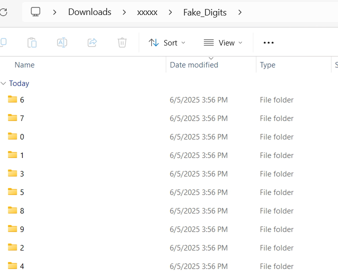

# 🗂️ Fake_Digits Folder Structure

This folder contains 100 fake digit images generated by the trained Generator model.

## 📁 Structure

- The digits are organized into 10 subfolders: `0`, `1`, ..., `9`.
- Each folder contains:
  - `.png` files: the generated digit image
  - `.txt` files: the corresponding latent vector used to generate the image

## 📸 Visual Examples

- Below are example views of the folder structure and file arrangement:

  
*High-level structure with digit-labeled subfolders*

  
*Detailed look into a single digit folder with paired `.png` and `.txt` files*
