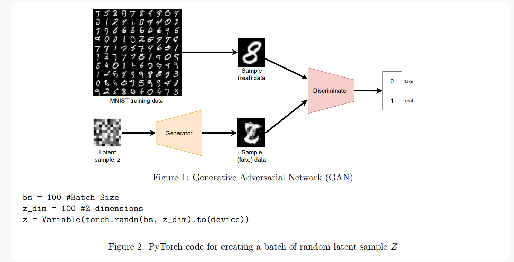
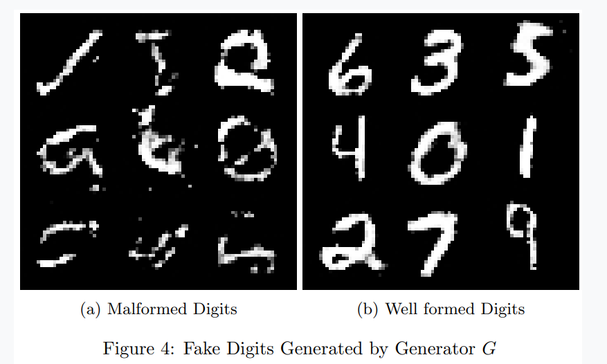
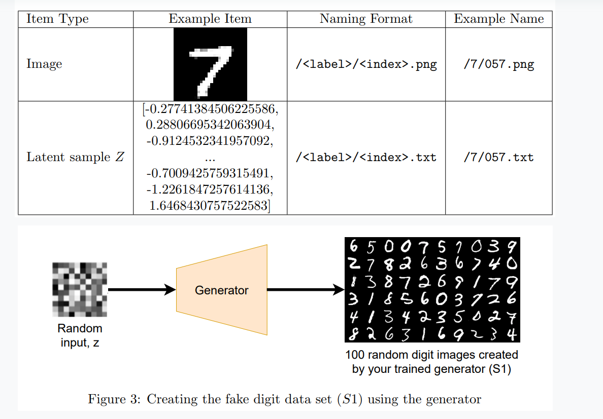
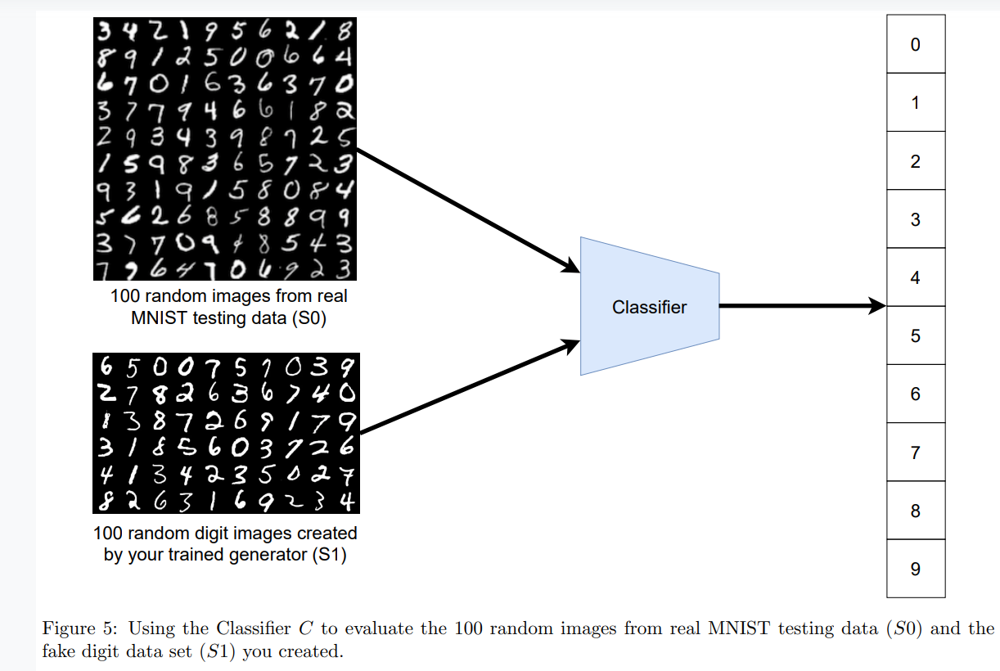
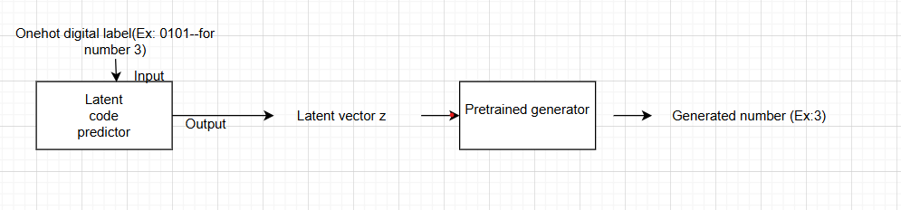

# 🧠 DigitGAN-MNIST

A PyTorch-based Generative Adversarial Network (GAN) project for generating handwritten MNIST digits, evaluating them with a classifier, and enabling controlled digit generation using a latent code predictor.

---

## 📌 Overview

This project explores how GANs can be used to synthesize handwritten digits similar to those in the MNIST dataset. It also uses a classifier to evaluate the quality of generated digits and introduces a method to generate **specific digits on demand**.

---

## 🔧 GAN Architecture

We trained a standard GAN with:
- A **Generator** that takes a 100-dimensional random latent vector `z` and outputs a 28×28 grayscale digit image.
- A **Discriminator** that distinguishes between real MNIST digits and generated images.

  

---

## 🖼️ Sample Digits Generated

Here are some digits produced by the Generator after training:

  

---

## 🧪 Evaluating Generated Digits (S1)

To measure the realism of generated digits, we:
- Created a test set of 100 fake digits (**S1**) from the Generator.
- Created a test set of 100 real MNIST digits (**S0**).
- Used a trained Classifier to evaluate both.

  

---

## 🎯 Classifier Model

The classifier was trained on the official MNIST dataset and achieved high accuracy. It was used to evaluate both real and fake images, and to filter good examples for training the Latent Code Predictor.

  

---

## 🔁 Controlled Digit Generation

A **Latent Code Predictor** network is introduced to generate a specific digit based on its label. Instead of sampling `z` randomly, can train a network to map a digit label (like “3”) to the correct `z` vector that, when passed to the Generator, produces an image of “3”.

  

---

## 📂 Files

- `GAN_for_MNIST.ipynb` — complete Colab notebook
- `/Images/` — architecture diagrams, output samples, and evaluation visuals
- `fakeimage_grid.png` — 10×10 grid of selected clean generated digits
- `C.pkl`, `D.pkl`, `G.pkl` — saved models (optional to include)

---

## ✅ Results

- **Classifier Accuracy (Test set)**: 98.98%
- **S0 classification error**: 0.00%
- **S1 classification error**: 18.00%

